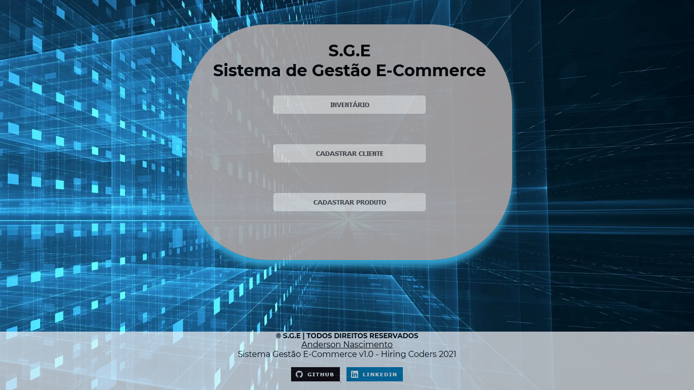

 

  

 
 ## 🚀 Tecnologias

Esse projeto foi desenvolvido com as seguintes tecnologias:

- HTML
- CSS
- JavaScript (Simular função Local Storage + Busca CEP)
- Google Fonts

## 💻 Projeto

Desafio 2: "Cadastro Clientes e Produtos" pela Gama Academy / Hiring Coders - VTEX

Neste desafio, utilizei a ideia de simular um ERP interno de Gestão E-Commerce, criando Formulário de Cadastro de Clientes e Produtos e mais um extra: o Inventário.

## 💻 Aprendizado

Gostei muito, mas como sou iniciante nesta presente data, estou com dificuldades e leva muito tempo de estudos para abordar melhores práticas de desenvolvimento até deixar mais "clean" e funcional.

OBS: A ideia fica em aberto para os colegas que quiserem ajudar a melhorar no desenvolvimento.

## Hospedado no Netlify

### 📝 LOG DEV 24/07/2021 - Anderson Nascimento

===  V1.0 ====

Base da gestão feita.

Segue em andamento para resoluções futuras:

* Construir layout adaptável para dispositivos móveis.

* Bug de funcão JavaScript de finalização de cadastro (mensagem prévia)

* Finalizar a questão do Inventário, incluir Search do Local Storage e exibir resultado da pesquisa, de clientes ou produtos previamente cadastrados).

 

